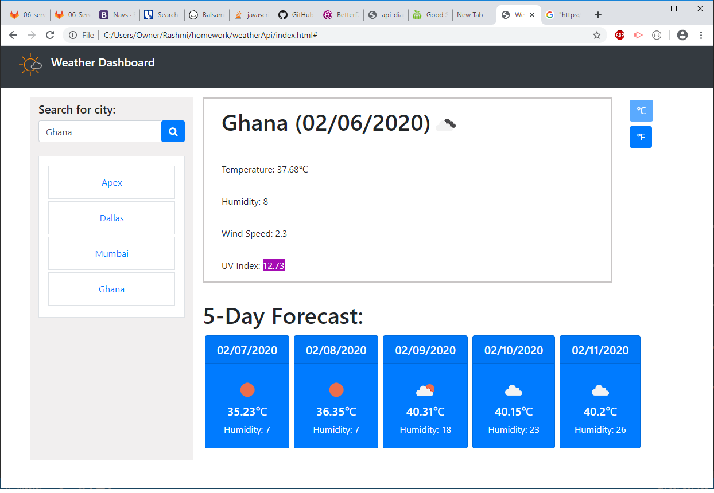

# The Repository
Weather API displays weather of a particular city. It is responsive in nature for large, medium and small screens. 

## Installation:
This project uses HTML, CSS with Bootstrap and jquery.
The code editor used here is VScode. Version controller is Github.

## Usage:
- Code quiz has questions and answers based on user-selected criteria for an easy quiz or hard quiz. This app will run in the browser and feature dynamically updated HTML and CSS powered by your JavaScript code.The user will be prompted to select mainly: 
    - **Easy**: Questions will generated for "Easy" level.
    - **Hard**: Questions will generated for "Hard" level.
- After answering user will be asked to enter "Initials" and show the "Highscore". 

## Deployed link:
[a link] (https://graphicaction.github.io/codeQuiz/)

- Highscore Screen:

## Credits:
UNC Chapelhill

## License
Copyright (c). All rights reserved.